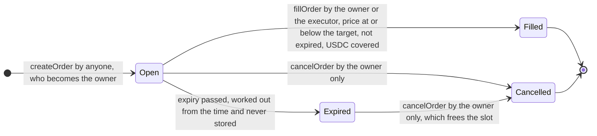

# Ledger Trigger contract specification

Ledger Trigger lets a user place a limit order to buy ETH with USDC: "when ETH costs this much or less, spend this much USDC on it and send the ETH to this address". The order lives in one smart contract, `LedgerTrigger`. Placing it moves no money. When the price feed reports a price at or below the target, the owner of the order, or the executor the owner named in it, calls `fillOrder`; only then does the contract take the USDC from the owner, swap it for ETH and send the ETH to the recipient. An off-chain program, the keeper, watches the price and makes that call; the contract does not trust the keeper and checks everything itself.

This document describes what the contract guarantees and how. It follows six parts: roles and permissions, functions, data structures, security rules, state machine and test scenarios. Three appendices follow: the steps of a fill and the minimum ETH output, the parts around the contract, and the design choices. Which test covers which scenario is listed in [test-matrix.md](test-matrix.md).

Names in `code font` are the names used in the contract. Amounts are whole numbers in each token's smallest unit: USDC has 6 decimals (1 USDC is `1000000`), prices have the price feed's decimals (8 for an ETH / USD feed, so 1500 USD is `150000000000`), and ETH has 18 decimals (1 ETH is 10^18 wei). One USDC is taken to be worth one US dollar throughout.

## What the system guarantees

1. **One contract with three functions that change state: place, fill and cancel an order.** Placing an order moves no money. Only when an order is filled does the contract take USDC from the owner's wallet, swap it for ETH and send the ETH to the recipient. The owner can cancel an order at any time while it is open, expired or not.
2. **Three roles: owner, executor and recipient. There is no admin.** Only the owner can cancel an order. Only the owner and the executor named in that order can fill it.
3. **Every fill gives two hard guarantees: the price paid is never above the target price, and the ETH received is never less than the price feed's price gives, minus the allowed slippage.** Both minimums are whole numbers rounded down, so each can fall short of the exact value by less than one wei, the smallest unit of ETH; that remainder is not counted (Appendix A).
4. **An order is stored in one of three states: `Open`, `Filled` or `Cancelled`. `Expired` is never stored; it is worked out from the time.** `Filled` and `Cancelled` are final. An expired order can no longer be filled; its owner can only cancel it, which frees its slot.
5. **The contract keeps no money.** Its USDC balance and its ETH balance are the same before and after every fill.

## 1. Roles and permissions

| Role                    | Who                                                                    | Can                                                                                                                                              | Cannot                                                                                              |
| ----------------------- | ---------------------------------------------------------------------- | ------------------------------------------------------------------------------------------------------------------------------------------------ | --------------------------------------------------------------------------------------------------- |
| Owner (`owner`)         | The account that calls `createOrder`                                   | Place orders; cancel its own orders; fill its own orders                                                                                         | Touch anyone else's orders                                                                          |
| Executor (`executor`)   | An address the owner names in each order, usually the keeper's account | Fill that one order                                                                                                                              | Cancel it; touch orders that do not name it; change any setting                                     |
| Recipient (`recipient`) | An address the owner names in each order, usually a cold wallet        | Receive the ETH of that order                                                                                                                    | Call anything because it is the recipient: the role gives no rights                                 |
| Anyone                  | Any account                                                            | Read: an order, its status, whether it can be filled now, an owner's open-order count and total. Place orders of its own, and so become an owner | Change anything about an order it does not own or execute                                           |
| Admin                   | **Does not exist**                                                     | -                                                                                                                                                | The contract has no pause, no upgrade, no function that changes a setting, no way to withdraw funds |

The executor is not an admin: each owner names it in each order, and it has rights over that order only. An owner may name itself as executor, and may name itself as recipient.

## 2. Functions

| Function                                                                                                                                      | Who can call                           | What it does                                                                                                                                                                                                                                | Moves money |
| --------------------------------------------------------------------------------------------------------------------------------------------- | -------------------------------------- | ------------------------------------------------------------------------------------------------------------------------------------------------------------------------------------------------------------------------------------------- | ----------- |
| `createOrder(usdcAmount, targetPrice, recipient, executor, expiry)`                                                                           | Anyone; the caller becomes the owner   | Checks the input (security rules, 4), stores an `Open` order and returns its ID. Needs no USDC allowance yet                                                                                                                                | No          |
| `fillOrder(orderId)`                                                                                                                          | Only the order's owner or its executor | Runs the checks, then takes the USDC from the owner, swaps it for ETH and sends all of that ETH to the recipient (Appendix A)                                                                                                               | Yes         |
| `cancelOrder(orderId)`                                                                                                                        | Only the order's owner                 | Turns an `Open` order, expired or not, into `Cancelled` and frees its slot. Reads nothing outside the contract, so it works whatever the price feed, the swap venue or the keeper does                                                      | No          |
| `getOrder(orderId)`                                                                                                                           | Anyone, read only                      | Returns every field of the order. Its `status` is the stored one, so an expired order still shows `Open` here; `statusOf` gives the status worked out from the time                                                                         | -           |
| `statusOf(orderId)`                                                                                                                           | Anyone, read only                      | Returns the status now, which is `Expired` for an order stored as `Open` whose expiry has passed                                                                                                                                            | -           |
| `canFill(orderId)`                                                                                                                            | Anyone, read only                      | Returns whether the order can be filled now and, if not, the first reason why (a `FillBlocker`). It runs the same checks as `fillOrder`, apart from who the caller is, and does not try the swap. The keeper asks it before it sends a fill | -           |
| `openOrderCount(owner)`, `openOrderTotal(owner)`                                                                                              | Anyone, read only                      | How many open orders an address has, expired ones included, and their USDC amounts added up. The total is the USDC allowance the owner needs to give the contract to cover them                                                             | -           |
| `receive()`                                                                                                                                   | Only the swap venue gets through       | Accepts the ETH a swap pays during a fill. ETH from anyone else is rejected, so nobody can lose ETH by sending it here by mistake                                                                                                           | -           |
| `usdc`, `priceFeed`, `swapVenue`, `maxOrderAmount`, `maxOpenOrdersPerOwner`, `maxPriceAge`, `maxSlippageBps`, `usdcDecimals`, `priceDecimals` | Anyone, read only; never reverts       | The seven deployment parameters, and the decimals of the token and of the price feed read at deployment                                                                                                                                     | -           |
| `constructor(usdc, priceFeed, swapVenue, maxOrderAmount, maxOpenOrdersPerOwner, maxPriceAge, maxSlippageBps)`                                 | Whoever deploys the contract           | Checks and stores the seven parameters (security rules, 4) and reads the two decimals. Nothing can change them later                                                                                                                        | -           |

### When each function rejects

Every rejection is a named error, listed here in the order the function checks. A rejected call changes nothing.

| Function                                    | Rejects with                                                                                                                                                                                                                                                                                                                                                                                                                                                                                                                                                                                                                                                                                                                                                                                                                                                                 |
| ------------------------------------------- | ---------------------------------------------------------------------------------------------------------------------------------------------------------------------------------------------------------------------------------------------------------------------------------------------------------------------------------------------------------------------------------------------------------------------------------------------------------------------------------------------------------------------------------------------------------------------------------------------------------------------------------------------------------------------------------------------------------------------------------------------------------------------------------------------------------------------------------------------------------------------------- |
| `createOrder`                               | `ZeroAmount`; `AmountAboveMax(amount, max)`; `ZeroTargetPrice`; `ZeroRecipient`; `ZeroExecutor`; `ExpiryNotInFuture(expiry, currentTime)` when the expiry is not after the current block's time; `TooManyOpenOrders(owner, max)` when the caller already has `maxOpenOrdersPerOwner` open orders, expired ones included                                                                                                                                                                                                                                                                                                                                                                                                                                                                                                                                                      |
| `fillOrder`                                 | `ReentrancyGuardReentrantCall` for a call made while a fill is running; `OrderNotFound(orderId)`; `NotOrderOwnerOrExecutor(orderId, caller)`; `OrderNotOpen(orderId, status)` when the order is `Filled` or `Cancelled`; `OrderExpired(orderId, expiry)`; `InvalidPrice(price)` when the feed's price is zero or below or its update time is after the current block's time; `StalePrice(updatedAt, maxPriceAge)`; `PriceAboveTarget(price, targetPrice)`; `InsufficientAllowance(allowance, needed)`; `InsufficientBalance(balance, needed)`. Then, while the money moves: `SwapUsdcMismatch(expectedBalance, actualBalance)` when the swap venue did not take exactly the order amount; `InsufficientEthOut(received, minEthOut)`; `EthTransferFailed(recipient, amount)`. An error raised by the price feed, the USDC token or the swap venue itself rejects the fill too |
| `cancelOrder`                               | `OrderNotFound(orderId)`; `NotOrderOwner(orderId, caller)`; `OrderNotOpen(orderId, status)` when the order is already `Filled` or `Cancelled`                                                                                                                                                                                                                                                                                                                                                                                                                                                                                                                                                                                                                                                                                                                                |
| `getOrder`, `statusOf`, `canFill`           | `OrderNotFound(orderId)` for an ID that no order has, ID 0 included. `canFill` also reverts when the price feed or the USDC token reverts as it reads them                                                                                                                                                                                                                                                                                                                                                                                                                                                                                                                                                                                                                                                                                                                   |
| `openOrderCount`, `openOrderTotal`, getters | Never; an address with no orders gets zero                                                                                                                                                                                                                                                                                                                                                                                                                                                                                                                                                                                                                                                                                                                                                                                                                                   |
| `receive`                                   | `UnexpectedEthSender(sender)` for ETH from anyone but the swap venue                                                                                                                                                                                                                                                                                                                                                                                                                                                                                                                                                                                                                                                                                                                                                                                                         |
| `constructor`                               | `ZeroUsdc`; `ZeroPriceFeed`; `ZeroSwapVenue`; `ZeroMaxOrderAmount`; `ZeroMaxOpenOrdersPerOwner`; `ZeroMaxPriceAge`; `SlippageTooHigh(maxSlippageBps)` when the slippage is 100 % or more. It also reverts when the token or the price feed does not report its decimals                                                                                                                                                                                                                                                                                                                                                                                                                                                                                                                                                                                                      |

A price exactly `maxPriceAge` seconds old still counts, a price equal to the target price can fill, and an order can still be filled in the very second of its expiry.

## 3. Data structures

### Deployment parameters

Seven values are given at deployment and stored as immutables: nothing can change them afterwards. The defaults below are the values the deployment scripts use; each can be set to another value at deployment (see the README).

| Name                    | Meaning                                                        | Default                                                                                                                                                                     |
| ----------------------- | -------------------------------------------------------------- | --------------------------------------------------------------------------------------------------------------------------------------------------------------------------- |
| `usdc`                  | The USDC token that orders spend                               | Locally, `MockUSDC`, a test token the scripts deploy; on the Sepolia test network, Circle's official test USDC                                                              |
| `priceFeed`             | The price feed for ETH in USD                                  | Locally, `MockPriceFeed`; on Sepolia, Chainlink's ETH / USD feed                                                                                                            |
| `swapVenue`             | The swap venue that turns USDC into ETH                        | `MockSwapVenue`, on Sepolia as well: real swap venues on that test network quote ETH at prices more than ten times away from the market price, so they cannot be used       |
| `maxOrderAmount`        | The largest amount of one order                                | 500 USDC                                                                                                                                                                    |
| `maxOpenOrdersPerOwner` | How many open orders one owner may have at the same time       | 5                                                                                                                                                                           |
| `maxPriceAge`           | How old, in seconds, a price may be and still count            | 4500 seconds (75 minutes): the Sepolia ETH / USD feed updates at least once an hour, and the extra 15 minutes keep a price from being refused just before its hourly update |
| `maxSlippageBps`        | The allowed slippage, in basis points (100 basis points = 1 %) | 100, that is 1 %                                                                                                                                                            |

At deployment the contract also reads the decimals of the token and of the price feed and stores them as `usdcDecimals` and `priceDecimals`, so no decimals are written into the code.

### The order: `struct Order`

| Field         | Meaning                                                                                                                 |
| ------------- | ----------------------------------------------------------------------------------------------------------------------- |
| `owner`       | The account that placed the order                                                                                       |
| `executor`    | The one address besides the owner that may fill it                                                                      |
| `recipient`   | Where the ETH goes                                                                                                      |
| `usdcAmount`  | How much USDC to spend, in its smallest unit (6 decimals)                                                               |
| `targetPrice` | The highest ETH price in USD the owner accepts, written like the feed's price (8 decimals for 1500 USD: `150000000000`) |
| `createdAt`   | The time of the block that placed the order                                                                             |
| `expiry`      | The last second, in Unix time, at which the order can be filled; one second later it has expired                        |
| `status`      | The stored status: `Open`, `Filled` or `Cancelled`, never `Expired`                                                     |

After an order is placed, its owner, executor and recipient never change.

### Other structs

- `OpenOrders`: for one owner, the number of open orders (`count`) and their USDC amounts added up (`total`).
- `FillCheck` (private): what the fill checks found for one order, used inside the contract so that `canFill` and `fillOrder` run one and the same set of checks.

### Mappings

- `orders`: order ID to `Order`. IDs start at 1 and go up by one; an ID is never used twice, and an order is never deleted. Read it with `getOrder`.
- `openOrdersOf`: owner address to `OpenOrders`. An order counts there while its stored status is `Open`, expired or not. Read it with `openOrderCount` and `openOrderTotal`.

### Enums

`OrderStatus`, where an order stands:

| Value       | Meaning                                                                                   |
| ----------- | ----------------------------------------------------------------------------------------- |
| `None`      | No order has this ID. Never returned: the read functions reject such an ID instead        |
| `Open`      | Placed, and not yet filled or cancelled                                                   |
| `Filled`    | Filled. Final                                                                             |
| `Cancelled` | Cancelled by its owner. Final                                                             |
| `Expired`   | Never stored. `statusOf` returns it for an order stored as `Open` whose expiry has passed |

`FillBlocker`, why an order cannot be filled right now, as `canFill` reports it. When several apply, the first in this list is reported.

| Value                   | Meaning                                                                                 |
| ----------------------- | --------------------------------------------------------------------------------------- |
| `None`                  | Nothing stops the fill                                                                  |
| `NotOpen`               | The order is `Filled` or `Cancelled`                                                    |
| `Expired`               | Its expiry has passed                                                                   |
| `InvalidPrice`          | The feed's price is zero or below, or its update time is after the current block's time |
| `StalePrice`            | The price is older than `maxPriceAge`                                                   |
| `PriceAboveTarget`      | The price is above the order's target price                                             |
| `InsufficientAllowance` | The owner's USDC allowance to the contract is below the order amount                    |
| `InsufficientBalance`   | The owner's USDC balance is below the order amount                                      |

### Events

One event for each change of state, kept on the chain for good.

| Event            | Fields                                                                                                                                                                  |
| ---------------- | ----------------------------------------------------------------------------------------------------------------------------------------------------------------------- |
| `OrderCreated`   | `orderId`, `owner`, `executor`, `recipient`, `usdcAmount`, `targetPrice`, `expiry`                                                                                      |
| `OrderFilled`    | `orderId`, `owner`, `filledBy` (the owner or the executor), `recipient`, `usdcAmount`, `ethReceived` (the ETH the recipient got, in wei), `price` (the feed price used) |
| `OrderCancelled` | `orderId`, `owner`, `afterExpiry` (whether the order had already expired)                                                                                               |

In `OrderCreated`, `orderId`, `owner` and `executor` are indexed, so they can be searched by value. The contract keeps no list of the orders that name an executor; the keeper finds its orders by searching `OrderCreated` for its own address as executor. In `OrderFilled`, `orderId`, `owner` and `filledBy` are indexed; in `OrderCancelled`, all three fields are.

### Modifiers

| Modifier                   | Rejects                                                                                                            |
| -------------------------- | ------------------------------------------------------------------------------------------------------------------ |
| `orderExists`              | An ID that no order has (`OrderNotFound`)                                                                          |
| `onlyOrderOwner`           | Any caller but the order's owner (`NotOrderOwner`)                                                                 |
| `onlyOrderOwnerOrExecutor` | Any caller but the order's owner and its executor (`NotOrderOwnerOrExecutor`)                                      |
| `onlyOpen`                 | An order whose stored status is not `Open` (`OrderNotOpen`); an expired order is still stored as `Open` and passes |

`fillOrder` also carries OpenZeppelin's reentrancy guard (`nonReentrant`), placed first. It checks the order's status as part of the fill checks, which it shares with `canFill`, rather than with `onlyOpen`.

### Errors

Every reason to reject has its own named error, never a sentence in a string, so the tests and the keeper can tell the reasons apart. Many errors carry the values that caused them: `PriceAboveTarget` the price and the target, `InsufficientAllowance` the allowance there is and the allowance needed. The table under "When each function rejects" lists them all. Two errors in the contract's interface come from OpenZeppelin: `ReentrancyGuardReentrantCall` and `SafeERC20FailedOperation` (a USDC call that failed without an error of its own, or returned false).

## 4. Security rules

The rules fall into six groups.

**1. Access control**

- Only the owner can cancel an order. The executor cannot either.
- Only the owner or the order's executor can fill it.
- There is no admin, no pause, no upgrade and no function that changes a parameter. All deployment parameters are immutable.

**2. State transitions**

- Only an `Open` order can become `Filled` or `Cancelled`. Both are final: an order never leaves them, and never goes from one to the other.
- An order whose expiry has passed cannot be filled. The only thing still possible is for its owner to cancel it.
- Order IDs are never reused, and a cancelled order never comes back.

**3. Payment safety**

- A fill always runs in this order: check, then mark the order `Filled`, and only then move money: take the USDC, swap it, send the ETH. A reentrancy guard comes on top.
- USDC is taken only from the order's owner, only the order amount, and only once per order.
- The swap venue's address is fixed at deployment. `fillOrder` takes no address and no instruction from its caller.
- If the swap brings in less ETH than the minimum output, the whole fill is rejected (Appendix A).
- After the swap, the swap venue's allowance is set back to zero.
- If the swap venue does not take exactly the order amount, or the ETH cannot be sent to the recipient, the whole fill is rejected: the order stays `Open` and the owner's USDC does not move.

**4. Input validation**

When an order is placed, any of these checks that fails rejects it:

- The amount is above zero and not above `maxOrderAmount`.
- The target price is above zero.
- Neither the recipient nor the executor is the zero address. The executor may be the owner.
- The expiry is in the future.
- The caller has fewer open orders than `maxOpenOrdersPerOwner`.

At deployment: none of the three addresses is the zero address; `maxOrderAmount`, `maxOpenOrdersPerOwner` and `maxPriceAge` are above zero; `maxSlippageBps` is below 100 % (10000 basis points), and may be zero.

**5. Auditability**

- Orders are never deleted. At any time, any order can be looked up by its ID, with all its fields and how it ended.
- Placing, filling and cancelling each emit an event. The fill event records the feed price used and the ETH actually received, so anyone can check afterwards that the price paid was not above the target.
- The cancel event records whether the order had already expired.

**6. Consistent ownership**

- The contract always knows each order's owner, executor and recipient, and none of the three can change after the order is placed.
- For every address, the open-order count and total always equal the number and the USDC sum of its orders whose stored status is `Open`.
- The contract keeps no money: its USDC and ETH balances are the same before and after every fill.

## 5. State machine

- Final states: `Filled` and `Cancelled`. An order can never be both filled and cancelled.
- `Expired` is not a stored state. In storage an expired order is still `Open`, so **it still takes one of its owner's open-order slots until the owner cancels it**. It can no longer be filled.
- When a fill and a cancel of the same order are sent at the same time, whichever the chain includes first takes effect, and the other is rejected.

## 6. Test scenarios

Expected results are written in four forms: a status change (`Open -> Filled`), "transaction must revert", "second call must revert", and "explicit error". Each scenario has an ID, S01 to S26; [test-matrix.md](test-matrix.md) lists the tests for each.

| ID  | Scenario                          | How                                                                                                                                            | Expected result                                                                                   |
| --- | --------------------------------- | ---------------------------------------------------------------------------------------------------------------------------------------------- | ------------------------------------------------------------------------------------------------- |
| S01 | Normal fill                       | Place an order; the price falls to the target; the executor fills it                                                                           | `Open -> Filled`; the ETH goes to the recipient, not to the caller                                |
| S02 | The owner fills                   | As S01, but the owner fills it                                                                                                                 | `Open -> Filled`                                                                                  |
| S03 | Cancel                            | Place an order; the owner cancels it                                                                                                           | `Open -> Cancelled`                                                                               |
| S04 | A stranger fills                  | An account that is neither the owner nor the executor fills                                                                                    | Transaction must revert                                                                           |
| S05 | Someone else cancels              | A stranger cancels; the executor cancels                                                                                                       | Transaction must revert                                                                           |
| S06 | Price not reached                 | Fill while the price is above the target                                                                                                       | Transaction must revert; the order stays `Open`                                                   |
| S07 | Filled twice                      | Fill the same order twice                                                                                                                      | Second call must revert                                                                           |
| S08 | Fill after cancel                 | Cancel an order, then fill it                                                                                                                  | Transaction must revert                                                                           |
| S09 | Cancel after fill                 | Fill an order, then cancel it                                                                                                                  | Transaction must revert                                                                           |
| S10 | Fill after expiry                 | Move the time past the expiry, then fill                                                                                                       | Transaction must revert; `statusOf` returns `Expired`                                             |
| S11 | Expiry boundary                   | Fill in the very second of the expiry; fill one second later                                                                                   | The first fills; the second must revert                                                           |
| S12 | Cancel after expiry               | The owner cancels an expired order                                                                                                             | It becomes `Cancelled`; one open-order slot is freed                                              |
| S13 | Price too old                     | The feed's last update is older than `maxPriceAge`                                                                                             | Transaction must revert                                                                           |
| S14 | Bad price                         | The feed reports zero or a negative price                                                                                                      | Transaction must revert                                                                           |
| S15 | Allowance too small               | The owner's allowance is below the order amount                                                                                                | Transaction must revert; the order stays `Open`; once the allowance is topped up, the order fills |
| S16 | Balance too small                 | The owner holds less USDC than the order amount                                                                                                | Transaction must revert; the order stays `Open`                                                   |
| S17 | Balance larger than the order     | The owner holds more USDC than the order amount, and the order fills                                                                           | Only the order amount is taken; the rest does not move                                            |
| S18 | A sixth order                     | Five orders are open; place one more                                                                                                           | Transaction must revert; once one is cancelled, a new one can be placed                           |
| S19 | Two orders, allowance for one     | Two orders, and an allowance that covers one of them                                                                                           | The first fills; the second is rejected (allowance too small); once topped up, it fills           |
| S20 | Bad input when placing            | Amount zero; amount above the single-order limit; target price zero; recipient the zero address; executor the zero address; expiry in the past | Each one must revert                                                                              |
| S21 | Too little ETH from the swap      | The swap venue gives less than the minimum output                                                                                              | Transaction must revert; the owner's USDC does not move                                           |
| S22 | Reentrancy                        | The recipient is a hostile contract that calls `fillOrder` again when it receives the ETH                                                      | The same order is never filled twice                                                              |
| S23 | Recipient cannot take ETH         | The recipient is a contract that refuses ETH                                                                                                   | Transaction must revert; the order stays `Open`; the USDC does not move                           |
| S24 | Unknown order                     | Look up an ID that no order has                                                                                                                | Explicit error (`OrderNotFound`)                                                                  |
| S25 | The contract keeps no money       | Any fill                                                                                                                                       | The contract's USDC and ETH balances after the fill equal those before it                         |
| S26 | ETH sent straight to the contract | Someone other than the swap venue sends ETH to the contract                                                                                    | Transaction must revert                                                                           |

The demo (`npm run demo`) plays six of these on a fresh local chain: S01 and S03, which must succeed, and S04, S06, S07 and S15, which must be rejected. It shows the correct flows and that incorrect ones are refused.
